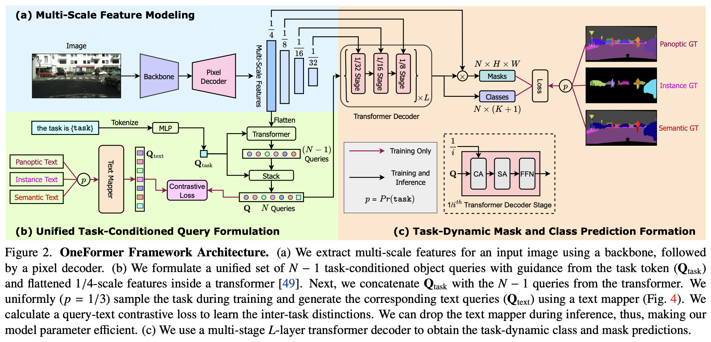

# OneFormer: One Transformer to Rule Universal Image Segmentation

### Abstract

지난 몇 십 년 동안 장면 파싱, panoptic segmentation, 그리고 최근의 새로운 panoptic architecture 등을 포함하여 이미지 segmentation을 통합하려는 시도가 있었습니다. 과거의 아키텍처는 semantic, instance, panoptic segmentation 각각에 대해 최상의 성능을 달성하기 위해 개별적으로 훈련이 필요했습니다. 진정한 통합 프레임워크는 한 번의 훈련만으로 세 가지 이미지 segmentation 작업 모두에서 SOTA(최첨단) 성능을 달성해야 합니다. 이를 위해, 우리는 단일 다중 작업 훈련 디자인으로 segmentation을 통합하는 보편적 이미지 segmentation 프레임워크인 OneFormer를 제안합니다. 

1. 먼저, semantic, instance, panoptic segmentation 각 도메인의 실제 데이터에 대해 단일 multi-task 훈련 프로세스 내에서 훈련을 가능하게 하는 task-conditioned joint training strategy를 제안합니다. 
2. 두 번째로, 모델이 주어진 작업에 맞게 동적으로 적응하도록 작업 토큰을 도입합니다. 
3. 세 번째로, 훈련 중 작업 간 및 클래스 간 구분을 명확히 하기 위해 쿼리-텍스트 대조 손실을 사용합니다. 

# 1. Introduction

Panoptic Segmentation: 형태가 없는 background 영역을 `stuff` , 형대가 분명한 객체를 `thing` 으로 정의하여, 두가지 모두 고려하여 식별.

ex)K-Net, MaskFormer, Mask2Former

Panoptic architecture를 사용하는 모델은 3가지 segmentation 방식에 사용할 수 있고, 성능이 높다는 장점을 가지고 있다.

그리고, 다른 2가지 방식은 개별로 훈련하여 시간이 소모될 뿐더러, 모델의 weight도 다를 것이다.

그래서 본 연구에서 OneFormer, multi-task universal image segmentation framework를 제안하고자 한다.

이 과정에서, 우리는 다음과 같은 질문에 답하는 것을 목표로 했다.

1. 왜 지금까지의 panoptic architecture는 single training process 또는 3가지 task에 모두 적용되지 않는가?
    
    그들의 architecture에 task guidance가 없기 때문이라고 추측한다. 동시에 학습하거나, 단일 모델에서 학습할 때 작업 간 차이를 학습하는 것이 어렵기 때문이다. 우리는 이를 task input token “the task is {task}”를 사용하여 초점을 맞춘 작업에 조건화하여 사용한다. 이에 따라, 이 단일 모델은 훈련을 위해 task-guided된 architecture가 되고, 추론을 위해 task-dynamic된다.
    
    {panoptic, instance, semantic} 작업을 균일하게 샘플링하고, 공동 훈련 과정에서 해당 실제 값(ground truth)을 사용하여 모델이 작업에 대한 편향이 없도록 합니다. 
    
    Semantic, instance label로부터 panoptic annotation을 도출하여 훈련에 사용한다. 즉, 훈련 과정에서는 panoptic data만 필요하다. 
    
    공동 훈련 시간, 모델 매개변수, 그리고 FLOP는 기존 방법들과 비교할 때 비슷하여 훈련 시간과 저장 요구 사항을 최대 3배 줄이고, 이미지 세그먼테이션을 덜 자원 집약적이고 더 접근 가능하게 만든다.
    
2. 어떻게 단일 공동 훈련 과정에서 multi-task 모델이 task 간 차이, class 간 차이를 잘 학습할 수 있는가?
    
    우리의 접근방식은 transformer를 기반으로 한, query token을 사용한 방식이다. 
    
    모델에 작업별 context를 추가하기 위해, 우리는 작업 입력에서 얻은 작업 토큰을 반복하여 우리의 쿼리를 초기화하고, 샘플링된 작업의 실제 레이블에서 파생된 텍스트와 쿼리-텍스트 contrastive loss를 계산한다. 쿼리에 대한 contrastive loss가 모델을 더 작업에 민감하게 안내하는 데 도움이 될 것이라 추측한다. 또한, 이는 카테고리 잘못 예측을 어느 정도 줄이는 데 도움이 된다.
    

이 모델은 다음과 같은 기여를 했다.

- Single universal architecture: 단일 모델 및 단일 데이터 세트로 한 번만 학습해도 되는, 트랜스포머를 기반으로 하는, 최초의 다중 작업 범용 이미지 분할 프레임워크
- Panoptic segmentation의 통합 목표 달성
- 표준 Swin-L Backbone을 사용하는 방법과 비교하여 세 가지 segmentation 작업 모두에서 새로운 최첨단 성능을 설정하고 새로운 ConvNeXt 및 DiNAT 백본으로 훨씬 더 향상되었다.

# 2. Related Work

## 2.1 Image Segmentation

## 2.2 Universal Image Segmentation

## 2.3 Transformer-based Architectures

# 3. Method

## 3.1 Task Conditioned Joint Training

## 3.2 Query Representations

## 3.3 Task Guided Contrastive Queries

## 3.4 Other Architecture Components

## 3.5 Losses

# 4. Experiments

## 4.1 Datasets and Evaluation Metrics

### Datasets

### Evaluation Metrics

## 4.2 Main Results

## 4.3 Ablation Studies

### ..

# 5. Conclusion

[Papers with Code - ADE20K val Benchmark (Instance Segmentation)](https://paperswithcode.com/sota/instance-segmentation-on-ade20k-val)
