# OneFormer: One Transformer to Rule Universal Image Segmentation

CVPR 2023. [Paper] [Page] [Github]
Jitesh Jain, Jiachen Li, MangTik Chiu, Ali Hassani, Nikita Orlov, Humphrey Shig
SHI Labs | IIT Roorkee | Picsart AI Research (PAIR)
10 Nov 2022


### Abstract

지난 몇 십 년 동안 장면 파싱, panoptic segmentation, 그리고 최근의 새로운 panoptic architecture 등을 포함하여 이미지 segmentation을 통합하려는 시도가 있었다. 과거의 아키텍처는 semantic, instance, panoptic segmentation 각각에 대해 최상의 성능을 달성하기 위해 개별적으로 훈련이 필요했다. 진정한 통합 프레임워크는 한 번의 훈련만으로 세 가지 이미지 segmentation 작업 모두에서 SOTA(최첨단) 성능을 달성해야 할 것이다. 이를 위해, 우리는 단일 다중 작업 훈련 디자인으로 segmentation을 통합하는 보편적 이미지 segmentation 프레임워크인 OneFormer를 제안한다. 

1. Semantic, instance, panoptic segmentation 각 도메인의 실제 데이터에 대해 단일 multi-task 훈련 프로세스 내에서 훈련을 가능하게 하는 task-conditioned joint training strategy를 제안한다
2. 모델이 주어진 작업에 맞게 동적으로 적응하도록 작업 토큰을 도입한다.
3. 훈련 중 작업 간 및 클래스 간 구분을 명확히 하기 위해 query-text contrastive learning을 사용한다. 

### [Keywords](./subpages/Keywords.md)

### [Evaluation Metrics](./subpages/Evaluation_Metrics.md)

# 1. Introduction

Panoptic Segmentation: 형태가 없는 background 영역을 `stuff` , 형대가 분명한 객체를 `thing` 으로 정의하여, 두가지 모두 고려하여 식별.

ex)K-Net, MaskFormer, Mask2Former

Panoptic architecture를 사용하는 모델은 3가지 segmentation 방식에 사용할 수 있고, 성능이 높다는 장점을 가지고 있다.

그리고, 다른 2가지 방식은 개별로 훈련하여 시간이 소모될 뿐더러, 모델의 weight도 다를 것이다.

그래서 본 연구에서 OneFormer, multi-task universal image segmentation framework를 제안하고자 한다.

이 과정에서, 우리는 다음과 같은 질문에 답하는 것을 목표로 했다.

1. 왜 지금까지의 panoptic architecture는 single training process 또는 3가지 task에 모두 적용되지 않는가?
    
    그들의 architecture에 task guidance가 없기 때문이라고 추측한다. 동시에 학습하거나, 단일 모델에서 학습할 때 작업 간 차이를 학습하는 것이 어렵기 때문이다. 우리는 이를 task input token “the task is {task}”를 사용하여 초점을 맞춘 작업에 조건화하여 사용한다. 이에 따라, 이 단일 모델은 훈련을 위해 task-guided된 architecture가 되고, 추론을 위해 task-dynamic된다.
    
    {panoptic, instance, semantic} 작업을 균일하게 샘플링하고, 공동 훈련 과정에서 해당 실제 값(ground truth)을 사용하여 모델이 작업에 대한 편향이 없도록 합니다. 
    
    Semantic, instance label로부터 panoptic annotation을 도출하여 훈련에 사용한다. 즉, 훈련 과정에서는 panoptic data만 필요하다. 
    
    공동 훈련 시간, 모델 매개변수, 그리고 FLOP는 기존 방법들과 비교할 때 비슷하여 훈련 시간과 저장 요구 사항을 최대 3배 줄이고, 이미지 세그먼테이션을 덜 자원 집약적이고 더 접근 가능하게 만든다.
    
2. 어떻게 단일 공동 훈련 과정에서 multi-task 모델이 task 간 차이, class 간 차이를 잘 학습할 수 있는가?
    
    우리의 접근방식은 transformer를 기반으로 한, query token을 사용한 방식이다. 
    
    모델에 작업별 context를 추가하기 위해, 우리는 작업 입력에서 얻은 작업 토큰을 반복하여 우리의 쿼리를 초기화하고, 샘플링된 작업의 실제 레이블에서 파생된 텍스트와 쿼리-텍스트 contrastive loss를 계산한다. 쿼리에 대한 contrastive loss가 모델을 더 작업에 민감하게 안내하는 데 도움이 될 것이라 추측한다. 또한, 이는 카테고리 잘못 예측을 어느 정도 줄이는 데 도움이 된다. 
    

이 모델은 다음과 같은 기여를 했다.

- Single universal architecture: 단일 모델 및 단일 데이터 세트로 한 번만 학습해도 되는, 트랜스포머를 기반으로 하는, 최초의 다중 작업 범용 이미지 분할 프레임워크
- Panoptic segmentation의 통합 목표 달성
- 표준 Swin-L Backbone을 사용하는 방법과 비교하여 세 가지 segmentation 작업 모두에서 새로운 최첨단 성능을 설정하고 새로운 ConvNeXt 및 DiNAT 백본으로 훨씬 더 향상되었다.

# 2. Related Work

## 2.1 Image Segmentation

MaskFormer는 Semantic segmentation 분야를 mask classification 분야로 최초로 취급했었고, 본 논문에서도 이러한 접근 방식을 가지고 있다.

기존의 Instance segmentation 분야 또한 mask classification 분야로 공식화되어, 2진 mask와 각각의 mask에 대한 class label을 예측한다. 본 논문에서도 역시 이러한 접근 방식을 가지고 있다.

Panoptic segmentation은 semantic과 instance segmentation를 통합하기 위해 제안되었었다. 최초는 instance와 semantic task의 brach들을 분리했던 Panoptic-FPN에서 소개되었으며, transformer 기반의 architecture로 발전해왔다. 하지만 아직까지 완전한 통합을 이루진 못했고, 본 논문에서 panoptic annotation만을 이용하여 통합하고자 한다.

## 2.2 Universal Image Segmentation

MaskFormer, Mask2Former, K-Net 에서 이미 semantic, instance segmentation에서도 잘 작동하는 panoptic segmentation이 등장한 바 있다.

K-Net은 CNN을 사용해서, 동적으로 학습이 가능한 instance, semantic kernel을 이분법 matching을 사용했다.

MaskFormer는 트랜스포머 기반 아키텍처로 mask classifier 역할을 한다. 이미지가 encoder로 공급되고 decoder가 query를 기반으로 제안을 생성하는 트랜스포머 범위의 객체 감지에 대한 DETR의 리포밍에서 영감을 얻었다.

Mask2Former는 MaskFormer를 학습가능한 query와 사용하고, decoder에 변형가능한 multi-scale의 attention을 사용하고, masked cross-attention을 사용하여 다른 두 모델의 성능보다 앞섰다.

하지만, 가장 좋은 성능을 내기 위해서 각각의 task에 개별적인 학습이 필요했다.

## 2.3 Transformer-based Architectures

DETR 이후로, transformer의 encoder-decoder 구조를 기반으로 한 object detection의 성능이 효과적으로 증가했다.

Mask2Former는 transformer 구조가 image segmentation (+ mask classification) 구조에 유리하다는 것을 입증했다.

추가적으로, 우리는 task-guided query에서 query-text contrastive loss를 계산하는 것이 모델이 task간의 차이를 학습하고, 모델 출력의 잘못된 classification을 줄일 수 있다는 것을 입증했다.

LMSeg에서는 multiple dataset의 분류에서 파생된 text를 사용하여 query-text contrastive loss를 계산하고, multi-dataset segmentation 문제를 해결하고자 했다.

본 연구에서는, LMSeg와는 다르게, multiple task에 초점을 맞추고, 훈련 데이터셋에 존재하는 ground-truth label을 사용해 query-text contrastive loss를 계산한다.

# 3. Method

OneFormer는 다음 2가지의 input을 가진다

- Image
- Task - “the task is {task}” : {panoptic, instance, semantic}


OneFormer의 학습 방법

1. Backbone과 pixel decoder를 사용해 Image로부터 multi-scale feature를 추출한다.
2. task input을 토큰화하여 object query를 조건화하는 1차원의 task token을 얻는다. 이는 각각의 input에 한 task model을 얻음을 의미한다.
3. Ground truth에 존재하는 각 class의 binary mask의 수를 표현하는 text list를 생성하고 text query 표현에 매핑한다.
    
    → text query는 image와 task에 따라 달라질 것.
    
    ```arduino
    text list : {"사람: 2", "자동차: 1"}
    text query : {”a photo with a person”, “a photo with a person”, “a photo with a car”}
    ```
    
4. 모델의 task-dynamic 예측을 supervise하기 위해 panoptic 주석에서 해당 ground truth 정보를 도출한다.
5. Ground truth는 task에 따라 달라지므로 object query에 task 구분이 있는지 확인하기 위해 객체와 text query 간의 query-text contrastive loss를 계산한다.
6. Object query와 multi-scale feature는 transformer 디코더에 입력되어 최종 예측을 생성한다.

## 3.1 Task Conditioned Joint Training

기존의 MaskFormer, Mask2Former, K-Net은 segmentation, instance, panoptic의 3가지 task에 대해 공동으로 학습할 경우 성능이 크게 저하됐다. 즉, multi-task 문제를 해결하지 못했는데, 이는 task 조건화가 없기 때문이라고 생각된다.

Multi-task train-once 문제를 ‘task로 조건화된 공동 학습 전략(Task Conditioned Joint Training)’을 사용하여 해결한다.

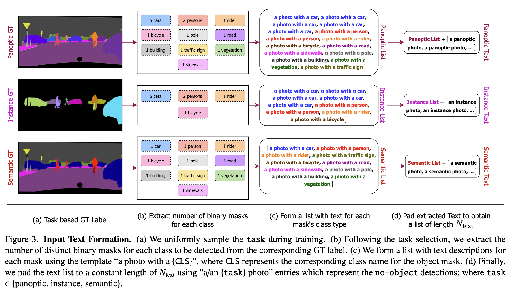

1. Ground truth 레이블에 대한 {panoptic, semantic, instance}에서 task를 균일하게 샘플링한 후, panoptic 주석에서 task별 레이블을 파생하여 하나의 주석 세트만 사용하여 panoptic 주석을 통합한다.
2. Task별 ground truth 레이블에서 이미지에 있는 각 class에 대한 binary mask 집합을 추출한다.
    - Semantic : only one amorphous binary mask
    - Instance : non-overlapping binary mask, only `thing` class, ignoring `stuff`
3. 모든 집합을 돌며 text list( $T_{list}$ )를 {”a photo with a {CLS}”} 형식으로 생성한다. {CLS}는 class 이름이 들어간다
4. 샘플 당 binary mask의 수가 다르기 때문에, 이를 처리하기 위해 $T_{list}$를 “a/an {task} photo” 로 패딩하여 길이가 $N_{text}$ $N_{text}$$T_{pad}$를 얻는다. 
    
    → Query-text contrastive loss를 계산하기 위해서도 이 $T_{pad}$를 사용한다. (Sec 3.3)
    

```arduino
// N_text가 5인 경우
T_pad : {
{a photo with a person, 
a photo with a person, 
a photo with a car},
{a phanoptic photo, 
a phanoptic photo}
}
```

토큰화되고 task-token ( $𝑄_{task}$ ) 에 매핑되는, “the task is {task}” 템플릿으로 구성된, task input( $I_{task}$ )을 사용하여 task에 대한 아키텍처를 조건화한다. 

→ $Q_{task}$ 를 사용하여 task에 대해 OneFormer를 컨디셔닝한다. (Sec 3.2)

## 3.2 Query Representations

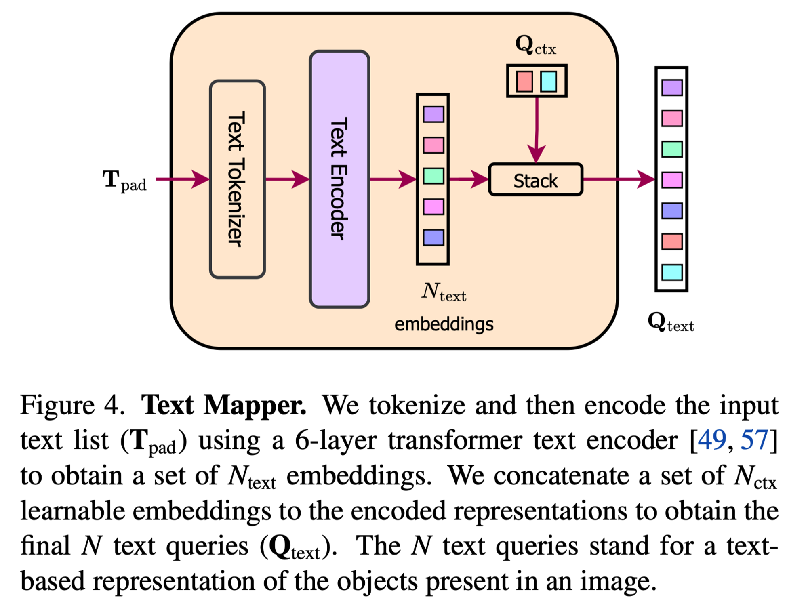

- Text query ( $Q_{text}$ ): image의 segment들의 text-based representation
- Object query ( $Q$ ): image의 segment들의 image-based representation

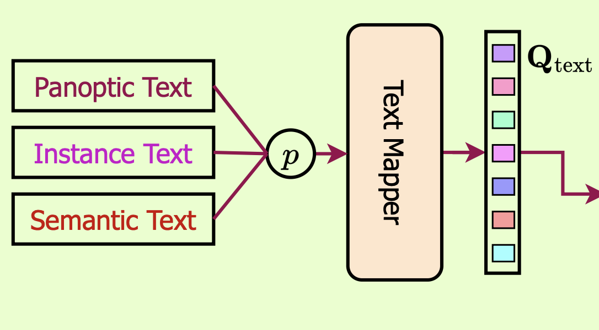

$Q_{text}$

$T_{pad}$ 토큰화 후, 6-layer transformer의 text-encoder를 통해 인코딩한다. 인코딩된 $N_{text}$개의 임베딩은 input image의 “binary mask의 수”와 “해당 mask의 class”를 나타낸다. 

$N_{ctx}$개의 임베딩을 가진 Learnable text context embedding ( $Q_{ctx}$ )의 집합과, 인코딩된 $N_{text}$개의 임베딩을 concat하여 최종 $N$개의 text query ( $Q_{text}$ ) 를 얻는다.

→ $Q_{ctx}$는 샘플 이미지에 대해 통합된 text context를 학습하기 위해 사용하는 것이다.  Training 중에만 text query를 사용하며, inference 중에는 text mapper 모듈을 삭제하여 모델의 크기를 줄일 수 있다.

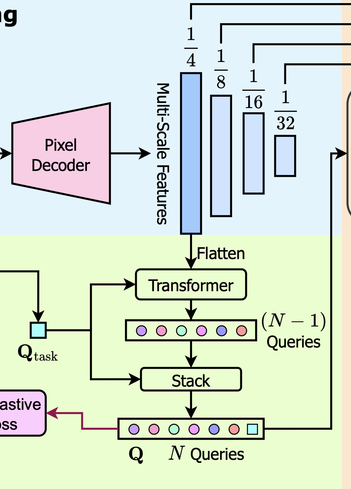

$Q$

Task token ( $Q_{task}$ ) 의 N-1번 반복으로 object query $Q'$을 초기화한 후, 2-layer transformer의 flatten된 1/4 scale의 feature guidance에 따라 $Q'$을 업데이트한다. 이 transformer에서 업데이트된 $Q'$은 $Q_{task}$와 concat되어 N개의 query들의, task로 컨디셔닝된 표현인, $Q$를 얻는다.

→ All-zeros 또는 random 초기화와 달리 task 기반 query 초기화와 $Q_{task}$와의 concat은 모델이 여러 segmentation task를 학습하는 데 중요하다. (Sec 4.3)

## 3.3 Task Guided Contrastive Queries

Object query ( $Q$ )는 task에 따라 다르다.

- Instance: query는 `thing` 클래스에만 집중해야 함
- Semantic: 하나의 amorphous object 만 예측해야 함
- Panoptic: 두가지의 혼합을 예측해야 함

기존에는 이러한 차이점을 고려하지 않으므로 3가지 task 모두에서 하나의 모델을 학습하는 것에 대해 실패한다.

이를 해결하기 위해 $Q$와 $Q_{text}$를 사용하여 query-text contrastive loss를 계산한다.

Sec 3.1에서 얘기했듯이, $T_{pad}$는 주어진 이미지에서 감지될 각 mask에 대한 text 표현 list이며, 객체 없음을 나타내는 (padding된) “a/an {task} photo”가 포함된다.

따라서, $Q_{text}$는 이미지에 존재하는 object/segment를 나타내는 $Q$의 목적과 일치한다.

이 둘 간의 contrastive loss를 사용하면 query 표현의 task간 구별을 성공적으로 학습할 수 있으며, class간 차이에 주의를 기울이고 category 오분류를 줄이는 효과도 있다.

$$
{\mathcal L}_{Q \rightarrow Q_{\text{text}}} = -\frac{1}{B} \sum_{i=1}^{B} \log \frac{\exp(q_{i}^{\text{obj}} \odot q_{i}^{\text{txt}} / \tau)}{\sum_{j=1}^{B} \exp(q_{i}^{\text{obj}} \odot q_{j}^{\text{txt}} / \tau)}
$$

$$
{\mathcal L}_{Q_{\text{text}} \rightarrow Q} = -\frac{1}{B} \sum_{i=1}^{B} \log \frac{\exp(q_{i}^{\text{txt}} \odot q_{i}^{\text{obj}} / \tau)}{\sum_{j=1}^{B} \exp(q_{i}^{\text{txt}} \odot q_{j}^{\text{obj}} / \tau)}
$$

$$
{\mathcal L}_{Q \leftrightarrow Q_{\text{text}}} = \mathcal{L}_{Q \rightarrow Q_{\text{text}}} + \mathcal{L}_{Q_{\text{text}} \rightarrow Q}
$$

B개의 object-text query쌍의 배치 ${(q^{obj}_i,x^{txt}_i)}^B_{i=1}$가 있다고 가정하자. 여기서 $q^{obj}_i$와 $q^{txt}_i$는 각각 i번째 쌍의 $Q$와 $Q_{text}$이다. Query 간의 유사도를 내적을 계산하여 측정한다. 전체 contrastive learning은 두가지 loss로 구성된다.

- object-to-text contrastive loss: ${L}_{Q \rightarrow Q_{\text{text}}}$
- text-to-object contrastive loss: ${L}_{Q_{\text{text}} \rightarrow Q}$

$\tau$는 contrastive logit의 크기를 조정하기 위한 학습가능한 temperature parameter이다.

## 3.4 Other Architecture Components

### Backbone and Pixel Decoder

Backbone: ImageNet으로 사전 학습된 backbone을 사용하여 입력 이미지에서 멀티스케일 feature는 표현을 추출한다. 

Pixel decoder: Backbone feature를 점진적으로 upsampling하여 feature는 모델링을 지원한다. 최근 multi-scale deformable attention의 성공에 힘입어 pixel decoder에 동일한 Multi-Scale Deformable Transformer (MSDeformAttn) 기반 아키텍처를 사용한다.

### Transformer Decoder

Transformer 디코더 내부의 고해상도 맵을 활용하기 위해 멀티스케일 전략을 사용한다.

Input

Object query ( $Q$ )와 pixel decoder의 multi-scale output ( $F_i$ , i∈{1/4, 1/8, 1/16, 1/32} )을 입력으로 제공한다. 

Process

원래 이미지의 1/8, 1/16, 1/32 해상도의 feature를 사용하여 masked cross-Attention (CA) 연산과 이어지는 self-attention (SA), feed-forward network (FFN)로 $Q$를 업데이트하며, transformer 디코더 내에서 이러한 연산을 $L$번 수행한다.

Output

Transformer 디코더의 최종 query 출력은 클래스 예측을 위해 K+1 차원 공간에 매핑된다. 여기서 K는 클래스 수를 나타내고 +1은 객체 없음 예측을 나타낸다. 

최종 마스크를 얻기 위해 Q와 F1/4 사이의 einsum 연산을 사용하여 원본 이미지의 1/4 해상도에서 F1/4을 디코딩한다. inference 중에는 최종 panoptic, semantic, instance segmentation 예측을 얻기 위해 Mask2Former와 동일한 post-processing 기술을 따른다. ADE20K, Cityscapes, COCO 데이터셋에 대한 panoptic segmentation을 위한 post-processing 중에 임계값 0.5, 0.8, 0.8을 초과하는 점수로만 예측을 유지한다.

## 3.5 Losses

Query에 대한 contrastive loss이외에도, 

- $\mathcal L_{cls}$ : class 예측에 대한 CE-loss
- $\mathcal L_{bce}$ : mask 예측에 대한 cross-entropy loss
- $\mathcal L_{dice}$ : mask 예측에 대한 dice loss

를 사용한다.

따라서 최종 loss function은 4개 loss의 가중합이며, 각각의 가중치를 다음과 같이 잡고,

$$
\lambda_{Q \leftrightarrow Q_{\text{text}}} = 0.5, \lambda_{\text{cls}} = 2, \lambda_{\text{bce}} = 5,  \lambda_{\text{dice}} = 5 
$$

최종 Loss를 다음과 같이 계산했다.

$$
\mathcal{L}_{\text{final}} = \lambda_{Q \leftrightarrow Q_{\text{text}}} \mathcal{L}_{Q \leftrightarrow Q_{\text{text}}} + \lambda_{\text{cls}} \mathcal{L}_{\text{cls}} + \lambda_{\text{bce}} \mathcal{L}_{\text{bce}} + \lambda_{\text{dice}} \mathcal{L}_{\text{dice}}
$$

Least cost assignment를 찾기 위해, 예측 집합과 ground truth 사이의 bipartite matching을 사용하였다.

객체 없음 예측의 경우 $\lambda_{cls}$를 0.1로 설정했다.

# 4. Experiments

## 4.1 Datasets and Evaluation Metrics

### Datasets

- Cityscapes
    - 19 class (11 `stuff` + 8 `thing` )
    - training-set: 2,975
    - validation-set: 500
    - test-set: 1,525
- ADE20K
    - 150 class (50 `stuff` + 100 `thing` )
    - training-set: 20,210
    - validation-set: 2,000
- COCO
    - 133 class (53 `stuff` + 80 `thing` )
    - training-set: 118,000
    - validation-set: 5,000

### Evaluation Metrics

- PQ
- AP
- mIoU

Task가 panoptic인 경우 PQ 점수를 보고하고 작업이 instance 및 semantic인 경우 유사하게 AP 및 mIoU 점수를 보고한다.

## 4.2 Main Results

### ADE20K

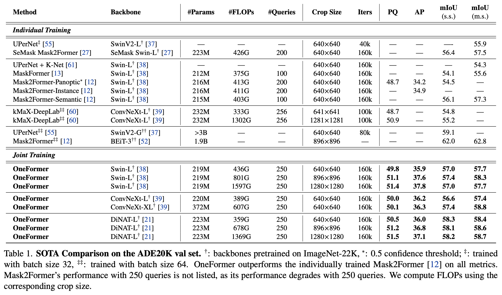

### Cityscapes

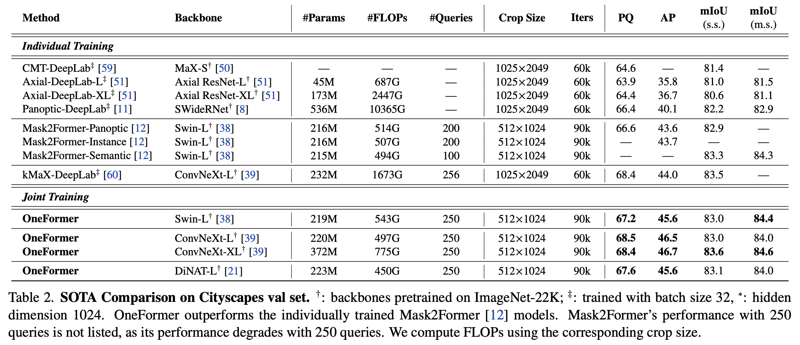

### COCO

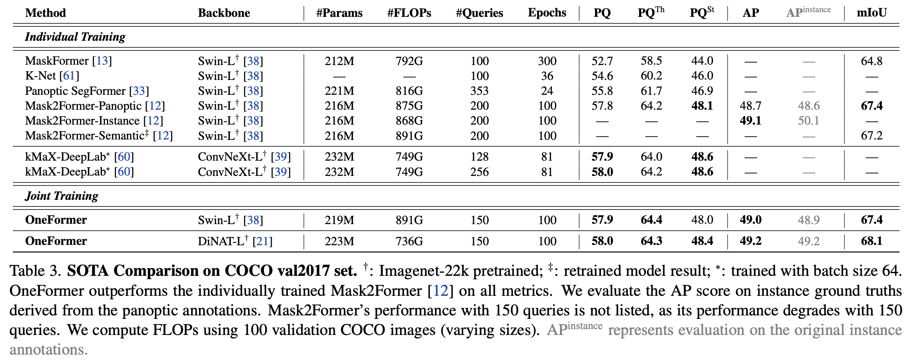

## 4.3 Ablation Studies

### Task-Conditioned Architecture

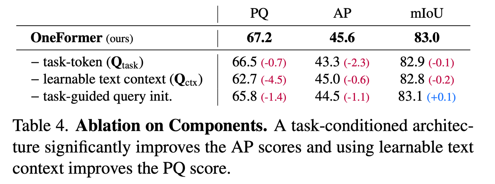

### Contrastive Query Loss

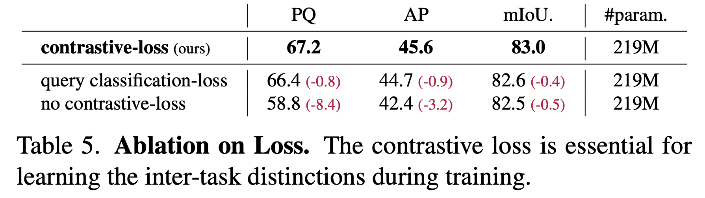

### Input Text Template

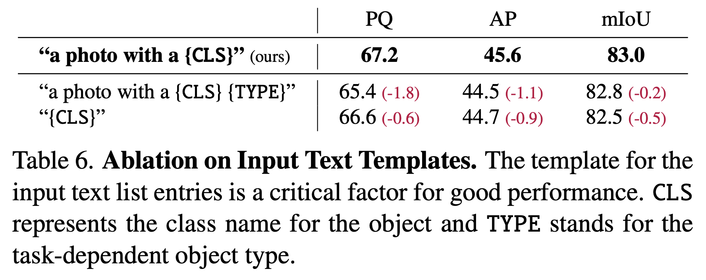

### Task Conditioned Joint Training

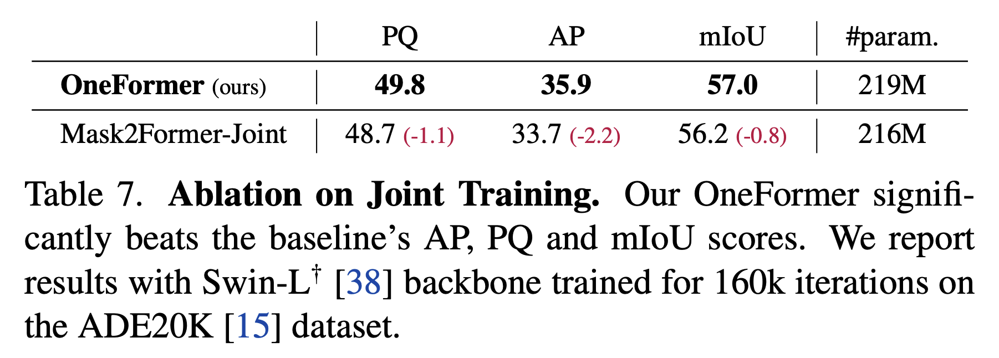

### Task Token Input

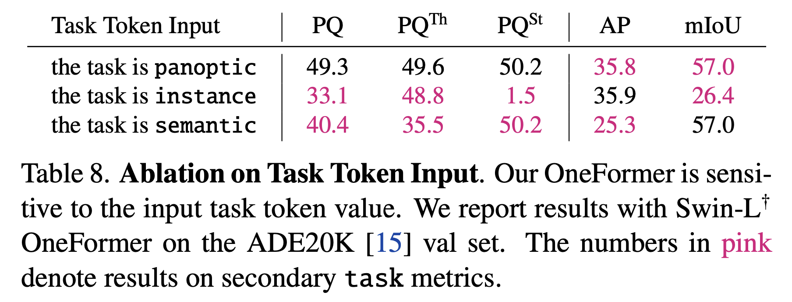

### Reduced Category Misclassifications

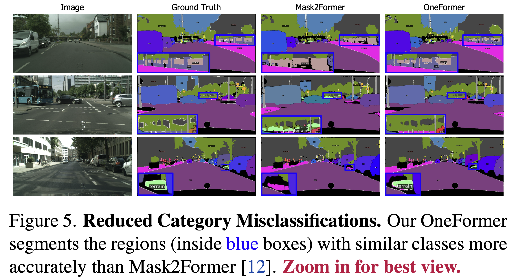

# 5. Conclusion

본 연구에서는 OneFormer라는 새로운 multi-task universal image segmentation 프레임워크를 제안한다. Transformer와 task-guided query를 통해 semantic, instance, panoptic segmentation을 단일 데이터셋으로 훈련한 단일 모델로 통합하였다.

이 모델은 3가지 segmentation 모두에서 이전의 SOTA인 Mask2Former 모델을 능가하는 성능을 보여준다.

또한, 단일 데이터셋으로 훈련한 단일 모델이기 때문에, OneFormer는 훈련 시간, 가중치 저장 및 추론 호스팅 요구 사항을 3분의 1로 줄일 수 있어 이미지 분할을 더 쉽게 접근할 수 있게 한다.