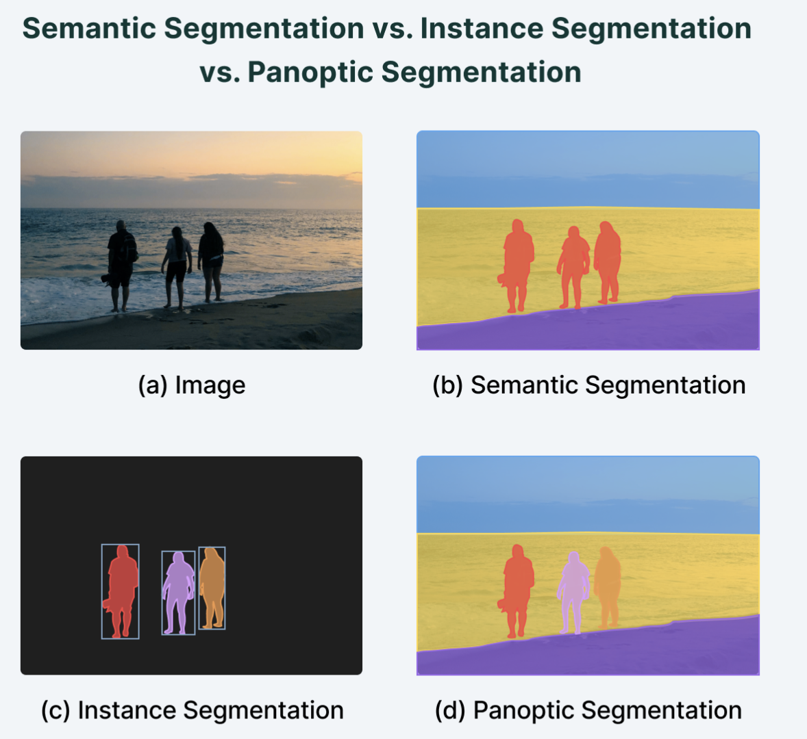

# Keywords

## Semantic Segmantation
Semantic Segmantation은 이미지의 각 픽셀을 사전 정의된 클래스 중 하나로 분류하는 작업이다.

## Instance Segmantation
Instance Segmantation은 각 객체를 개별적으로 식별하고, 객체의 경계를 구분하여 각 객체에 대한 binary mask와 class label을 예측하는 작업이다.

## Panoptic Segmantation
Panoptic Segmantation은 Semantic Segmantation과 Instance Segmantation을 통합한 방식으로, 이미지의 모든 픽셀을 분류함과 동시에 각 객체를 개별적으로 식별하는 작업이다.
